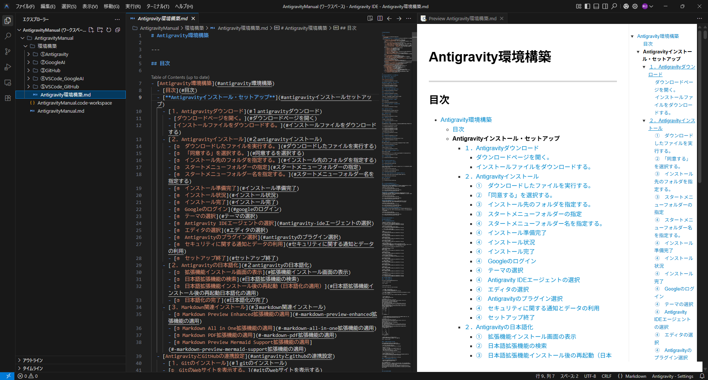
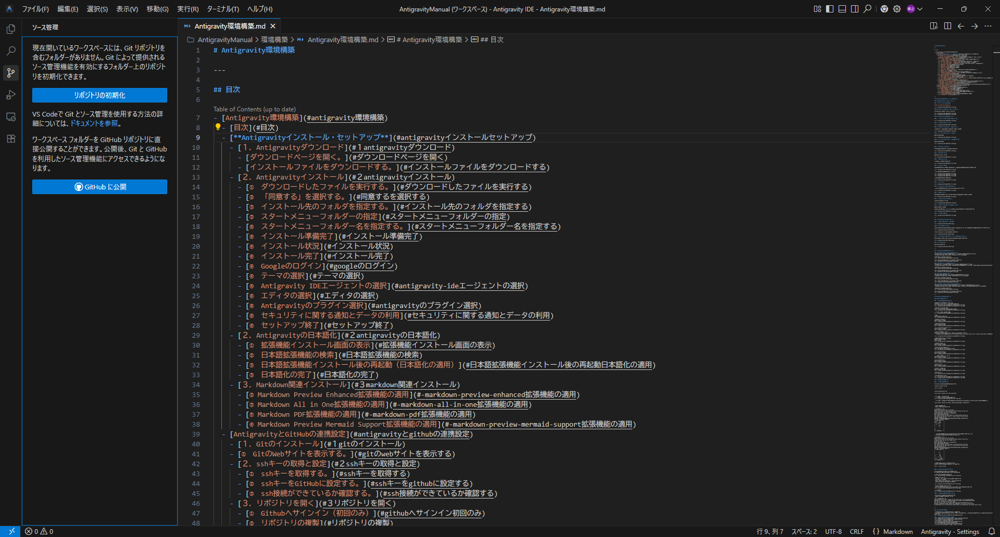
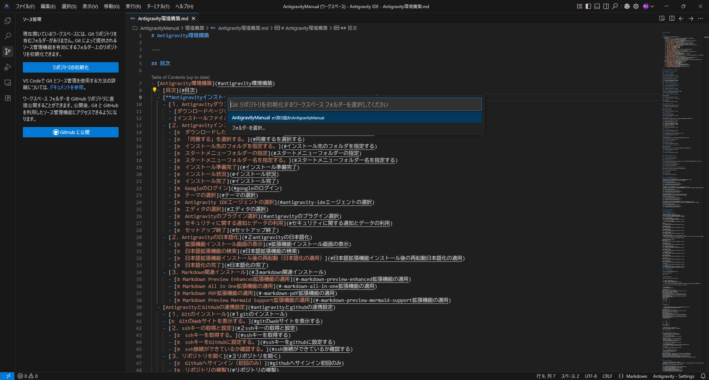
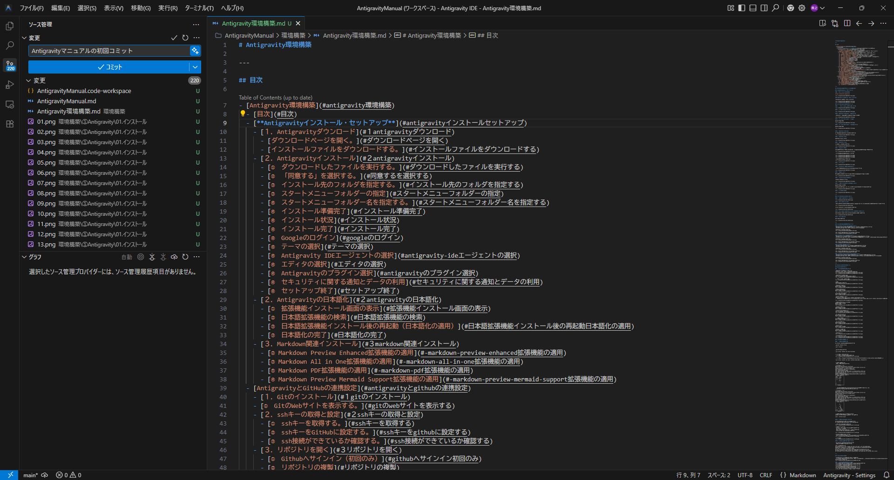
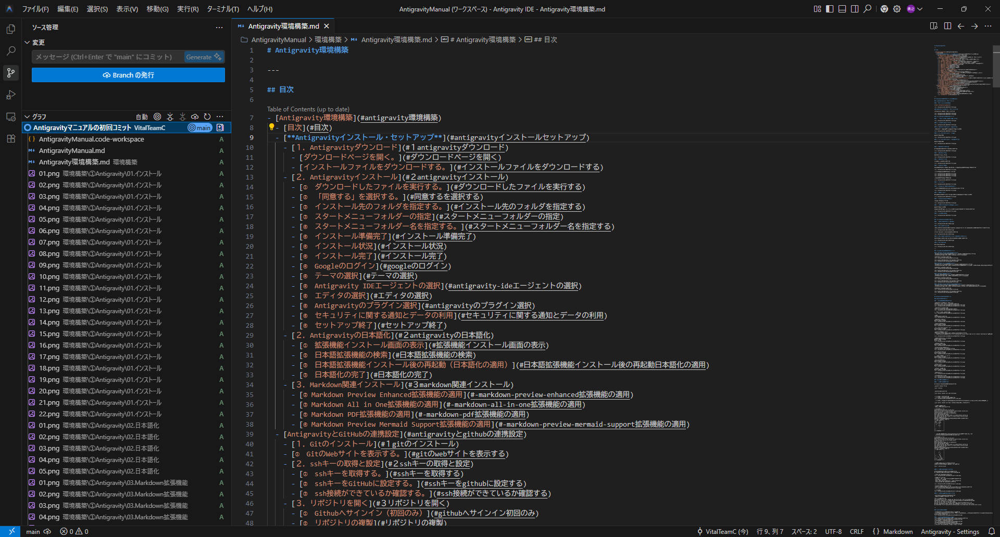
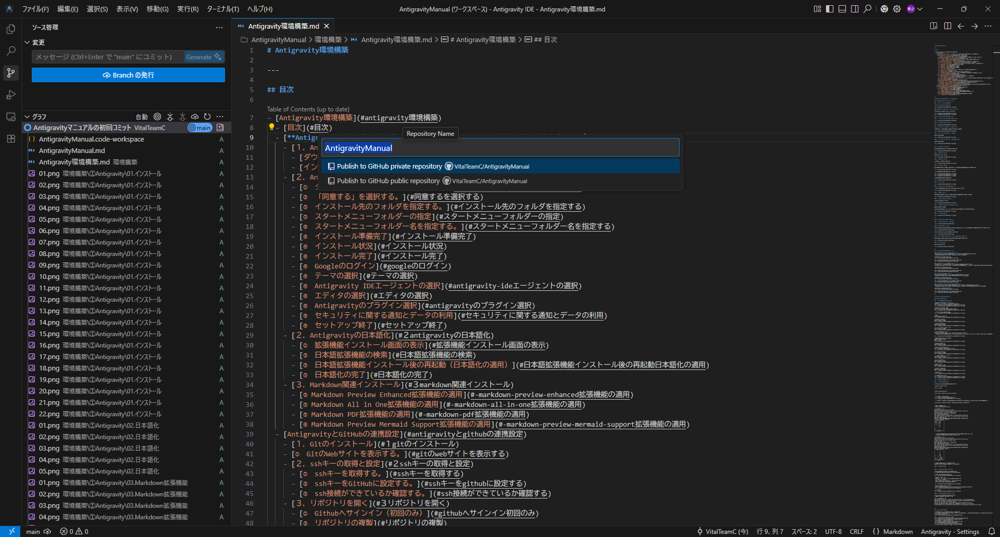
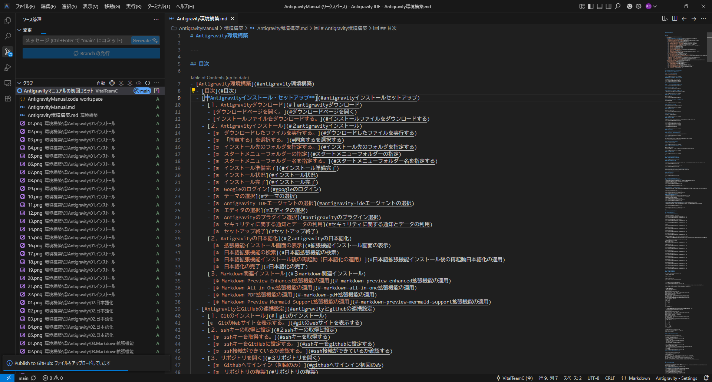
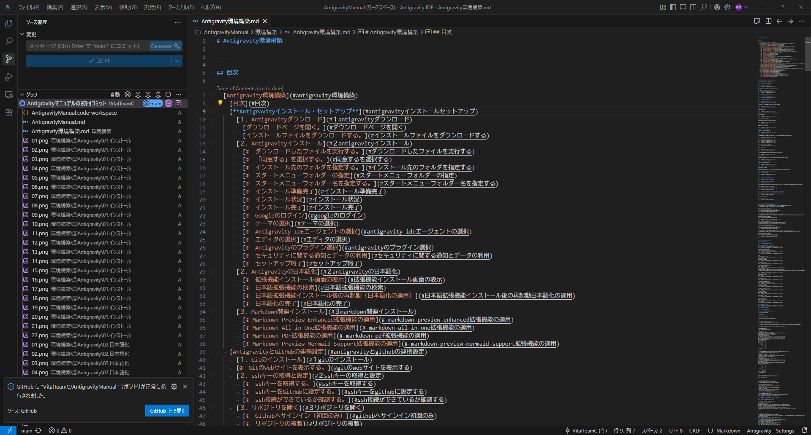
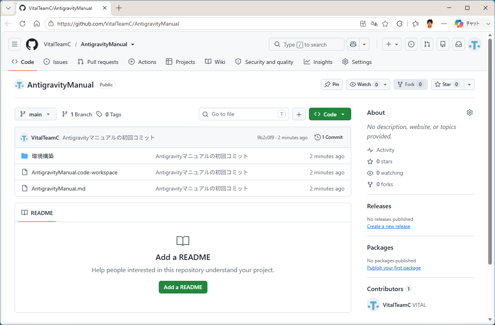
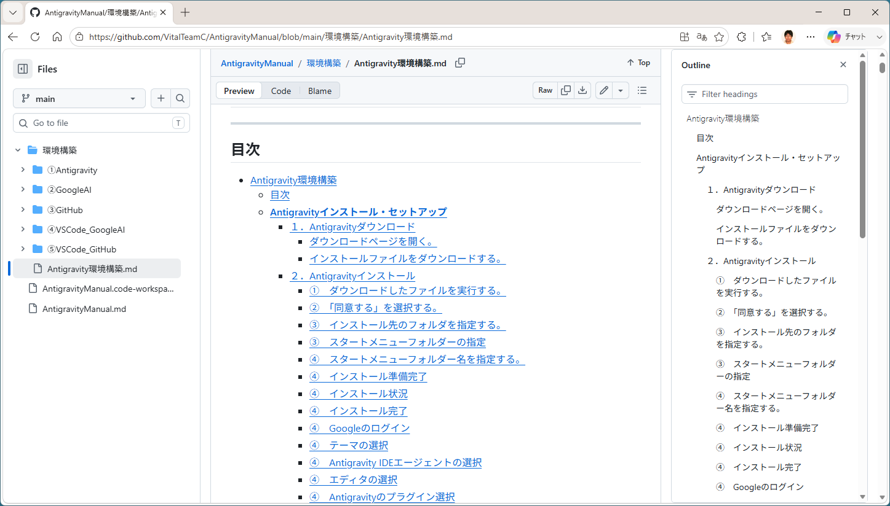

# Gitの操作方法

---

## 目次

- [Gitの操作方法](#gitの操作方法)
  - [目次](#目次)
  - [はじめに](#はじめに)
    - [①Gitとは](#gitとは)
    - [②GitHubとの違い](#githubとの違い)
  - [用語](#用語)
  - [ワークスペースをGitHubへ公開する](#ワークスペースをgithubへ公開する)
    - [①　ワークスペースを作成する。(Coming Soon?)](#ワークスペースを作成するcoming-soon)
    - [②　ワークスペースをGitHubに登録する。](#ワークスペースをgithubに登録する)
  - [ファイルをGithubにアップロード（プッシュ）する。](#ファイルをgithubにアップロードプッシュする)
  - [ファイルをダウンロード（プル）する。](#ファイルをダウンロードプルする)
  - [フェッチでGitHubのリポジトリの状況を確認する。](#フェッチでgithubのリポジトリの状況を確認する)
  - [コンフリクトを検出して解消する。](#コンフリクトを検出して解消する)

---

## <u>はじめに</u>
本書は、Antigravity上でGitを扱う事を前提に、最低限必要な操作を解説します。Gitは多機能でありそれを全て記載することは困難ですので、詳しい解説は以下のGit-Webサイトを参照してください。

https://git-scm.com/learn

### ①Gitとは

* ファイルの変更履歴を管理するバージョン管理システム
* コマンドラインで操作するツール群を提供する
* VS CodeなどのGUIツールからも操作できる

### ②GitHubとの違い

Gitは、各自のPC上でファイルの変更履歴を管理する仕組みです。
GitHubは、Gitのリポジトリをインターネット上で共有・管理するためのサービスです。

## <u>用語</u>

| 用語         | 説明                                                                                         |
| ------------ | -------------------------------------------------------------------------------------------- |
| リポジトリ   | Gitが管理する変更履歴（バージョン管理情報）の保管場所です。                                  |
| ステージ     | コミット対象となるファイルを登録する操作です。                                               |
| コミット     | ステージに登録した変更内容をリポジトリへ記録する操作です。                                   |
| プッシュ     | ローカルのリポジトリをGitHubへ反映する操作です。                                             |
| プル         | GitHub上の変更内容をローカルへ取り込む操作です。                                             |
| フェッチ     | GitHubの最新情報を取得しますが、ローカルには反映しない操作です。                             |
| コンフリクト | 同じファイルの同じ箇所がローカルとGitHubで異なる内容に変更され、自動で統合できない状態です。 |
| マージ       | コンフリクトが発生したとき、複数の変更内容を統合する操作です。                               |

## <u>ワークスペースをGitHubへ公開する</u>
ローカルでGit環境を作成し、GitHubへ公開（GitHubにリポジトリを作成）する作業です。

### ①　ワークスペースを作成する。(Coming Soon?)
VS Codeでワークスペースを作成します。

* VS Codeで「フォルダを開く」をクリックする。
* 任意のフォルダを指定する。
* 空のワークスペースが作成される。

### ②　ワークスペースをGitHubに登録する。

* ワークスペースを作成する。
　以下は、すでにドキュメントを作成している状態である。

* 「リポジトリの初期化」をクリックする。

* リポジトリを作成するワークスペースフォルダを選択する。
　ここでは「AntigravityManual」を選択している。

* コミットする。
　コミット時は、メッセージの入力が必須になっている。
　ここでは「Antigravityマニュアルの初回コミット」としている。
　

* コミットの完了
　コミットはローカルのGitに対して行っている。

* Branchの発行
　Githubにアップロードするために「Branchの発行」をクリックする。
　アップロードはPublic(メンバ以外も閲覧可能)、Private(メンバのみ閲覧可能)を選択できる。
　ここでは、Public（公開）を選択している。

* Githubへの公開完了

* Githubを確認
　Githubに登録・閲覧できる。

## <u>ファイルをGithubにアップロード（プッシュ）する。</u>

(Coming Soon?)

## <u>ファイルをダウンロード（プル）する。</u>

(Coming Soon?)

## <u>フェッチでGitHubのリポジトリの状況を確認する。</u>

(Coming Soon?)

## <u>コンフリクトを検出して解消する。</u>

(Coming Soon?)
